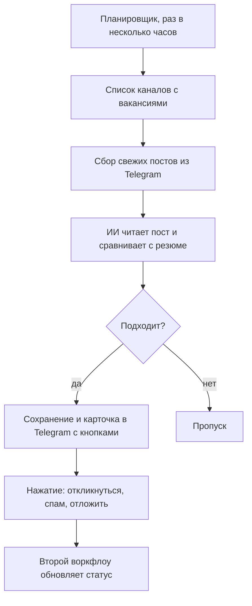
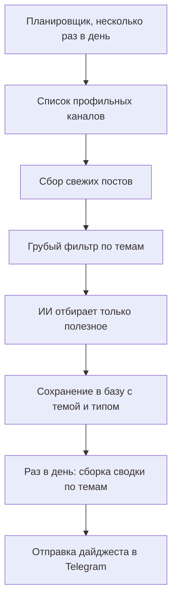

# n8n Telegram Automations

**Набор личных автоматизаций на n8n, которые каждый день экономят время: поиск работы, отбор полезного из инфополя и утренняя сводка в Telegram.**

Это не учебные примеры и не заготовки, а рабочие автоматизации, которые крутятся в проде круглые сутки. Каждая закрывает свою бытовую задачу: перестать вручную листать десятки Telegram-каналов, ничего важного не упускать и получать готовый результат прямо в мессенджер. Собрано на self-hosted n8n, вся тяжелая работа по чтению и оценке текста отдана искусственному интеллекту.

Репозиторий, это витрина: здесь описано, как устроены автоматизации и почему сделаны именно так. Реальные конфиги, ключи, токены и адреса сюда не входят, вместо секретов везде нейтральные заглушки.

## Оглавление

- [JobScout, поиск работы на автопилоте](#jobscout-поиск-работы-на-автопилоте)
- [InfoScout, личный дайджест по темам](#infoscout-личный-дайджест-по-темам)
- [Утренний дайджест](#утренний-дайджест)
- [Как запустить у себя](#как-запустить-у-себя)
- [Стек технологий](#стек-технологий)
- [Об авторе](#об-авторе)

---

## JobScout, поиск работы на автопилоте

*Круглосуточный монитор вакансий, который читает объявления вместо вас и приносит только подходящее.*

### Что это

JobScout следит за Telegram-каналами с вакансиями и сам разбирает каждое новое объявление. Искусственный интеллект понимает, вакансия перед ним или нет, сравнивает ее с резюме, оценивает, насколько она подходит, и подсказывает, на что сделать упор в отклике. В итоге в личку прилетают только стоящие предложения, а не весь поток подряд.

### Проблема, которую решает

Каналов с вакансиями много, постов в них сотни в день, и большая часть, это мимо. Листать все руками долго и утомительно, а между делом легко пропустить именно то, что нужно. Хочется видеть не ленту, а короткий список из нескольких вакансий, которые реально стоит рассмотреть.

### Как это работает

1. Планировщик раз в несколько часов запускает проверку.
2. Автоматизация берет список отслеживаемых каналов и забирает из них свежие посты.
3. Каждый новый пост уходит в искусственный интеллект: он решает, вакансия это или нет, вытаскивает условия (зарплата, формат, стек, требования) и ставит оценку соответствия резюме.
4. Подходящие вакансии сохраняются, а лучшие из них приходят в Telegram короткой карточкой с оценкой и подсказкой по отклику.
5. Под каждой карточкой три кнопки: откликнуться, в спам, отложить.
6. Второй воркфлоу ловит нажатия и обновляет статус вакансии, а само сообщение помечается, чтобы было видно, что с ней уже сделано.

### Почему так устроено

JobScout, это два связанных воркфлоу, а не один. Первый занят только поиском и присылкой вакансий, второй, отдельно, слушает нажатия кнопок и обновляет статусы. Так удобнее: тяжелый мониторинг работает по расписанию, а реакция на кнопки идет своим быстрым циклом и не мешает основному потоку.

Состояние (какие посты уже просмотрены и что решено по каждой вакансии) хранится в базе, поэтому одно и то же не показывается дважды и ничего не теряется между запусками. Оценку и разбор делает искусственный интеллект, а не набор ключевых слов, из-за этого отбор получается по смыслу, а не по случайному совпадению слов.

### Польза и результат

Часы ручного просмотра каналов превращаются в несколько минут в день. Ничего важного не теряется, а отбор персональный: система смотрит именно на соответствие вашему опыту и подсказывает, чем зацепить работодателя. Остается только нажать кнопку.

### Статус

Работает в проде, на обслуживании.

---

## InfoScout, личный дайджест по темам

*Персональный редактор, который читает профильные каналы за вас и оставляет только то, что применимо в работе.*

### Что это

InfoScout следит за Telegram-каналами по рабочим темам (SEO, iGaming, искусственный интеллект) и несколько раз в день просматривает свежие посты. Искусственный интеллект отбирает только реально полезное: конкретные инструменты, рабочие методики, разборы кейсов, важные изменения в правилах и алгоритмах. Реклама, вода, анонсы и шум отсекаются.

### Проблема, которую решает

Чтобы быть в теме, надо читать десятки каналов, но полезного в них, малая доля. Время уходит на прокрутку ленты, а ценные вещи тонут среди новостей ни о чем, рекламы курсов и однотипных постов. Нужен не поток, а короткая выжимка: что появилось нового и что с этим делать.

### Как это работает

1. Планировщик несколько раз в день запускает обход каналов.
2. Автоматизация забирает свежие посты и прогоняет их через грубый предварительный фильтр по темам.
3. Оставшееся уходит в искусственный интеллект, он по строгим правилам решает, полезен пост или нет, и если да, коротко формулирует суть одной строкой.
4. Полезные находки складываются в базу с пометкой темы и типа (инструмент, методика, кейс, изменение на рынке).
5. Раз в день из накопленного собирается аккуратная сводка и уходит в Telegram.

### Почему так устроено

Отбор идет в два шага. Сначала дешевый грубый фильтр отсеивает очевидный мусор, и только то, что прошло, попадает к искусственному интеллекту. Так тратится меньше ресурсов, а на умную оценку остается лишь то, что этого стоит.

Правила отбора намеренно жесткие: по умолчанию пост считается бесполезным, и пометку полезно он получает, только если это реально применимо в работе. Лучше пропустить лишнее, чем засорять базу пустыми новостями. Каждая находка сразу привязана к теме и типу, поэтому потом ее легко собрать в понятную сводку.

### Польза и результат

Вместо ручного чтения десятков каналов, готовая подборка главного. Экономится время, ничего важного не проходит мимо, а на выходе не лента, а короткий список полезного, разложенный по темам.

### Утренний дайджест

Финальный шаг InfoScout, это утренняя сводка. Раз в день автоматизация берет отобранные за сутки материалы и присылает в Telegram аккуратный дайджест, разбитый по темам, короткими понятными строками. Сначала тема, затем несколько пунктов по сути, каждый в одну строку, чтобы можно было пробежать глазами за минуту и сразу понять, что появилось нового.

Смысл в том, чтобы информация была не просто собрана, а удобна для быстрого просмотра. Не нужно никуда заходить и что-то искать: утром готовая выжимка уже в мессенджере.

### Статус

Работает в проде, на обслуживании.

---

## Как запустить у себя

Сами воркфлоу лежат в папке [`workflows/`](workflows) в виде обезличенных шаблонов. Все приватные данные из них убраны и заменены на заглушки вида `YOUR_GOOGLE_SHEET_ID`, `YOUR_TELEGRAM_CHAT_ID`, `YOUR_TELEGRAM_BOT_TOKEN` и так далее.

- `workflows/jobscout-vacancy-monitor.json`, мониторинг вакансий и присылка карточек.
- `workflows/jobscout-buttons.json`, обработка нажатий кнопок и обновление статусов.
- `workflows/infoscout.json`, отбор полезного из каналов и утренняя сводка (утренний дайджест собран внутри этого воркфлоу).

Чтобы поднять у себя: импортируйте нужный файл в свой n8n (Import from File), заведите свои креды для Google Sheets, Telegram и Claude, подставьте свои значения вместо заглушек и создайте таблицы с нужными листами. Реальные ключи и токены в репозиторий не попадают, держите их только в n8n или в переменных окружения.

## Стек технологий

- **n8n**, движок автоматизаций, self-hosted, все воркфлоу работают по расписанию круглосуточно.
- **Telegram Bot API**, доставка карточек и сводок, а также кнопки и реакция на нажатия.
- **Claude AI**, чтение, оценка и краткое изложение текста по смыслу, а не по ключевым словам.
- **Google Sheets**, хранение состояния и находок: списки каналов, вакансии, отобранные материалы.
- **Планировщик**, запуск по расписанию: мониторинг несколько раз в день и утренняя сводка.

## Об авторе

Anton, автоматизирую рутину для себя. Это пет-проекты про то, как переложить скучную ручную работу на n8n и искусственный интеллект: меньше листать ленты, больше заниматься делом. Все три автоматизации живут в проде и потихоньку допиливаются по ходу использования.
